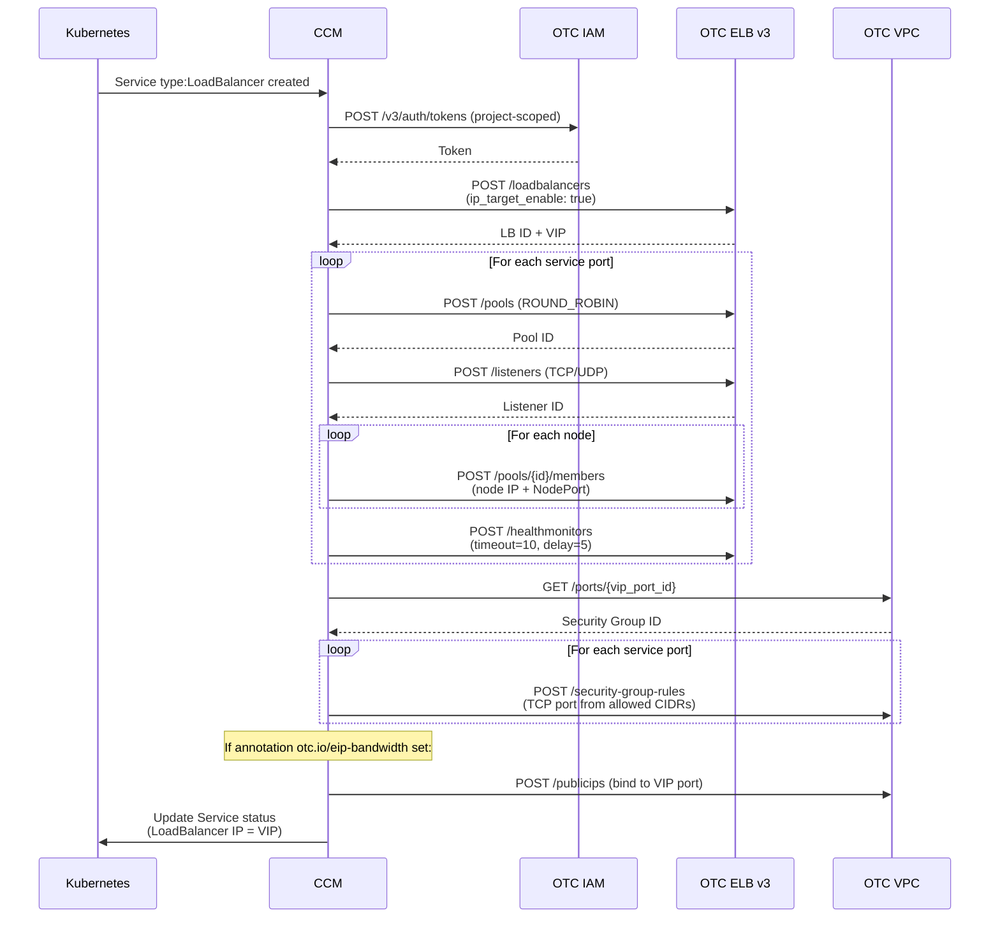
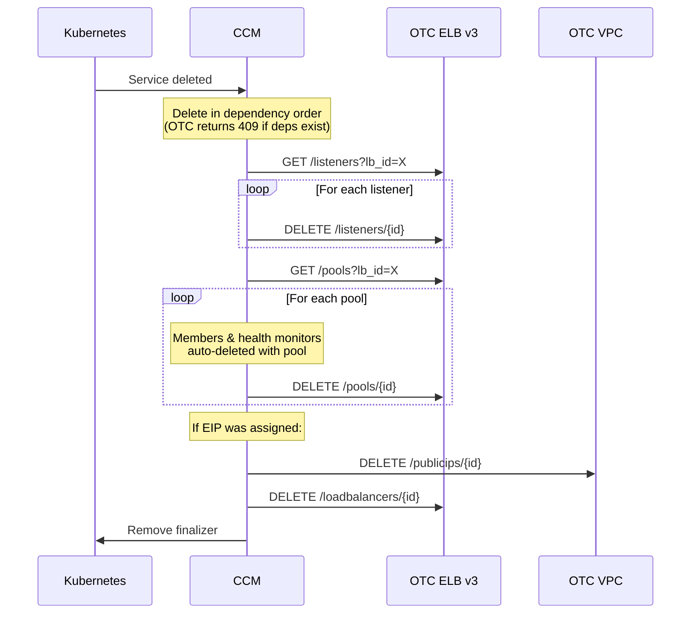
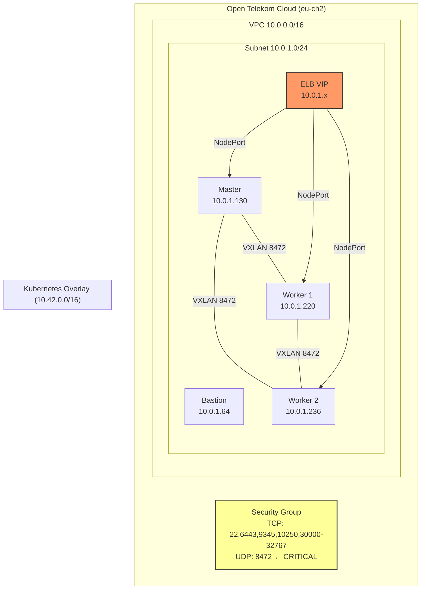

# Development Guide

## Project Structure

```
swiss-otc-cloud-manager/
├── cmd/
│   └── cloud-controller-manager/
│       └── cloud-controller-manager.go   # Main entry point, registers OTC provider
├── pkg/
│   └── opentelekomcloud/
│       ├── opentelekomcloud.go           # Cloud provider interface implementation
│       ├── config/
│       │   └── config.go                 # YAML config parser (cloud.conf)
│       ├── loadbalancer/
│       │   ├── loadbalancer.go           # K8s LoadBalancer interface (Ensure/Delete/Get)
│       │   └── client.go                 # OTC ELB v3 HTTP client (all API calls)
│       └── instances/
│           └── instances.go              # Node instance metadata (minimal)
├── charts/
│   └── swiss-otc-ccm/                    # Helm chart
├── deploy/
│   └── swiss-otc-ccm.service            # Systemd unit file
├── docs/
│   ├── NETWORKING.md                     # Critical: OTC networking & VXLAN fix
│   └── CHANGELOG.md                     # Release history
├── Dockerfile                            # Multi-stage build
├── README.md                             # Project overview
└── DEVELOPMENT.md                        # This file
```

## API Flow: Create LoadBalancer



## API Flow: Delete LoadBalancer



## Network Layout



## Swiss OTC eu-ch2 API Specifics

### Health Monitor: timeout >= delay

Standard OpenStack documentation states `timeout < delay`. **Swiss OTC eu-ch2 requires the opposite:**

```
✅ Working:  delay=5, timeout=10, max_retries=3
❌ Fails:    delay=5, timeout=3, max_retries=3
```

All pre-existing working ELBs in the project use `timeout=10, delay=5`.

### vip_subnet_cidr_id (NOT vip_subnet_id)

The ELB v3 API in eu-ch2 uses `vip_subnet_cidr_id` which maps to the **Neutron subnet ID** (from the VPC subnet API), not `vip_subnet_id`.

### ip_target_enable: true

Required for IP-based backend members. Without this, the ELB creates internal routing ports but does not forward actual traffic to backends.

### VIP Security Group

OTC automatically creates a separate security group on the ELB's VIP port. This SG only has a self-referencing rule + SSH by default. The CCM must add ingress rules for each service port.

### Async Delete (409 Race Condition)

OTC processes listener and pool deletions asynchronously. Attempting to delete the parent ELB before child resources finish deleting returns HTTP 409 (`ELB.8907`). The CCM handles this by deleting in dependency order with waits.

## Building

```bash
# Standard build
go build -o bin/swiss-otc-cloud-controller-manager ./cmd/cloud-controller-manager/

# Cross-compile for Linux
GOOS=linux GOARCH=amd64 go build -o bin/swiss-otc-cloud-controller-manager ./cmd/cloud-controller-manager/

# Docker
docker build -t swiss-otc-ccm:latest .
```

## Debugging

### CCM Logs (systemd)
```bash
journalctl -u swiss-otc-ccm -f
```

### Verify ELB via API
```bash
TOKEN=$(curl -s -X POST $IAM_ENDPOINT/auth/tokens ...)
curl -H "X-Auth-Token: $TOKEN" "$ELB_ENDPOINT/loadbalancers" | python3 -m json.tool
```

### Check pool member status
```bash
curl -H "X-Auth-Token: $TOKEN" "$ELB_ENDPOINT/pools/$POOL_ID/members"
# operating_status: ONLINE = healthy, OFFLINE = health check failing
```

### tcpdump for traffic verification
```bash
# On a node: check if ELB health checks arrive
tcpdump -i enp0s3 tcp port $NODEPORT -nn

# Check VXLAN overlay traffic
tcpdump -i enp0s3 udp port 8472 -nn
```
