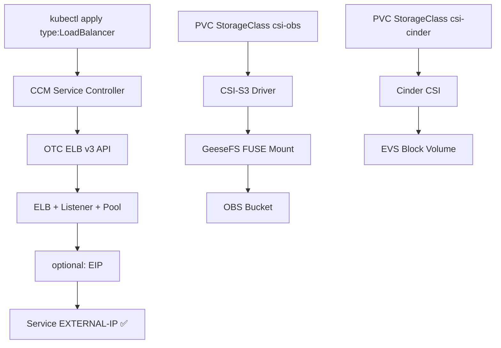

# Swiss OTC RKE2 Cloud Manager

RKE2 Kubernetes Cluster auf der Swiss Open Telekom Cloud (`eu-ch2`) — cloud-native mit automatischem ELB-Management, EVS Block Storage und OBS Object Storage.



## 🚀 Team Onboarding

Neu im Projekt? Start hier: **[docs/TEAM-ONBOARDING.md](docs/TEAM-ONBOARDING.md)**

## Features

- **Automatic ELB v3** — `type: LoadBalancer` → OTC Dedicated ELB, automatisch
- **EIP Management** — Annotation → öffentliche IP, automatisch
- **OBS ReadWriteMany** — CSI-S3 mit GeeseFS, mehrere Pods gleichzeitig
- **EVS Block Storage** — Cinder CSI, ReadWriteOnce
- **Shared ELB** — Ein pre-deployed ELB für mehrere Services
- **nginx-internal / nginx-public** — zwei IngressClasses, je nach EIP-Bedarf
- **Vollautomatisch** — GitHub Actions Pipeline: Terraform + Helm + Deploy

## Dokumentation

| Dokument | Beschreibung |
|---|---|
| [docs/QUICKSTART-CLI.md](docs/QUICKSTART-CLI.md) | Deployment via CLI ohne GitHub Actions |
| [docs/POST-INSTALL.md](docs/POST-INSTALL.md) | CCM, CSI, OBS Annotations & Konfiguration |
| [docs/GITOPS.md](docs/GITOPS.md) | Fleet, FluxCD, ArgoCD, direktes Helm |
| [docs/ENGINEERING-LOG.md](docs/ENGINEERING-LOG.md) | Bekannte Probleme, Einschränkungen, Workarounds |
| [docs/STORAGE.md](docs/STORAGE.md) | Storage ausführlich (EVS + OBS) |
| [docs/OBS-MULTI-TENANT.md](docs/OBS-MULTI-TENANT.md) | Multi-Tenant OBS StorageClasses |
| [docs/NETWORKING.md](docs/NETWORKING.md) | VPC, Security Groups, ELB SNAT |
| [docs/ARCHITECTURE.md](docs/ARCHITECTURE.md) | Architektur-Überblick |

## Quick Start (GitHub Actions)

### 1. Secrets setzen

`Settings → Secrets → Actions`:

| Secret | Wert |
|---|---|
| `OTC_ACCESS_KEY` | IAM AK |
| `OTC_SECRET_KEY` | IAM SK |
| `OTC_PROJECT_ID` | Project ID |
| `OTC_USERNAME` | IAM Username |
| `OTC_PASSWORD` | IAM Password |
| `OTC_DOMAIN_NAME` | `OTC000...` |
| `RKE2_TOKEN` | `openssl rand -hex 32` |
| `SSH_PRIVATE_KEY` | Ed25519 Private Key |
| `SSH_PUBLIC_KEY` | Ed25519 Public Key |
| `GHCR_PULL_TOKEN` | GitHub PAT (`read:packages`) |

### 2. Repository Variables (optional)

`Settings → Variables → Actions`:

| Variable | Default | Beschreibung |
|---|---|---|
| `ENABLE_SHARED_ELB` | `true` | Pre-deployed shared ELB |
| `SHARED_ELB_EIP` | `false` | EIP am shared ELB |
| `CCM_ELB_EIP` | `true` | CCM ELBs public → nginx-public |
| `DEPLOY_INGRESS_NGINX` | `true` | ingress-nginx deployen |

### 3. Pipeline starten

```
Actions → Infra Apply → Run workflow → confirm: APPLY
```

### 4. Demo App aufrufen

Nach ~15 Minuten: URL aus Pipeline-Log (`ELB External-IP: x.x.x.x`)

## Architektur

```
eu-ch2 Region
├── VPC (10.0.0.0/16)
│   ├── Subnet (10.0.1.0/24)
│   │   ├── Bastion / Jumpserver (TinyProxy)
│   │   ├── RKE2 Master
│   │   ├── RKE2 Worker-1
│   │   └── RKE2 Worker-2
│   └── Security Groups
│       ├── SSH (22)
│       ├── K8s API (6443), RKE2 (9345)
│       ├── NodePort (30000-32767)
│       └── ELB SNAT (100.125.0.0/16)
├── OTC ELB v3 (CCM-managed, pro Service)
├── Shared ELB (Terraform-managed, optional)
└── OBS Bucket (Terraform State + geesefs Binary)
```

## Kube-native Storage

### OBS (ReadWriteMany)
```yaml
storageClassName: csi-obs
accessModes: [ReadWriteMany]
```

### EVS Block (ReadWriteOnce)
```yaml
storageClassName: csi-cinder-sc-delete
accessModes: [ReadWriteOnce]
```

## Ingress

```yaml
# VPC-intern
ingressClassName: nginx-internal

# Public (nur wenn CCM_ELB_EIP=true)
ingressClassName: nginx-public
```

## Bekannte Einschränkungen

Siehe [docs/ENGINEERING-LOG.md](docs/ENGINEERING-LOG.md) für vollständige Liste.

- **geesefs** muss nach jedem Apply manuell via Bastion auf Nodes installiert werden (OBS-Download von Nodes scheitert)
- **Cinder CSI** Controller crasht (EVS PVC bleibt Pending) — AK/SK Auth nicht vollständig kompatibel
- **EIP Release** braucht 3-5 Minuten nach Destroy

## Lizenz

MIT
