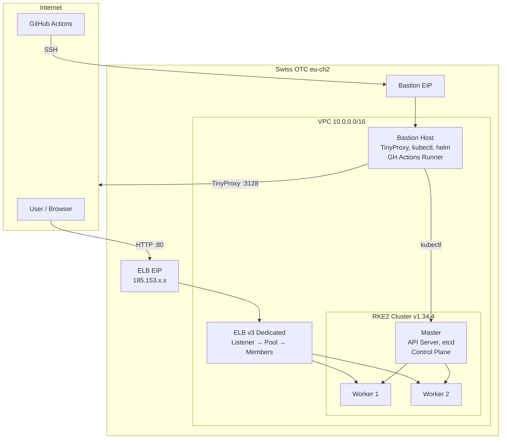
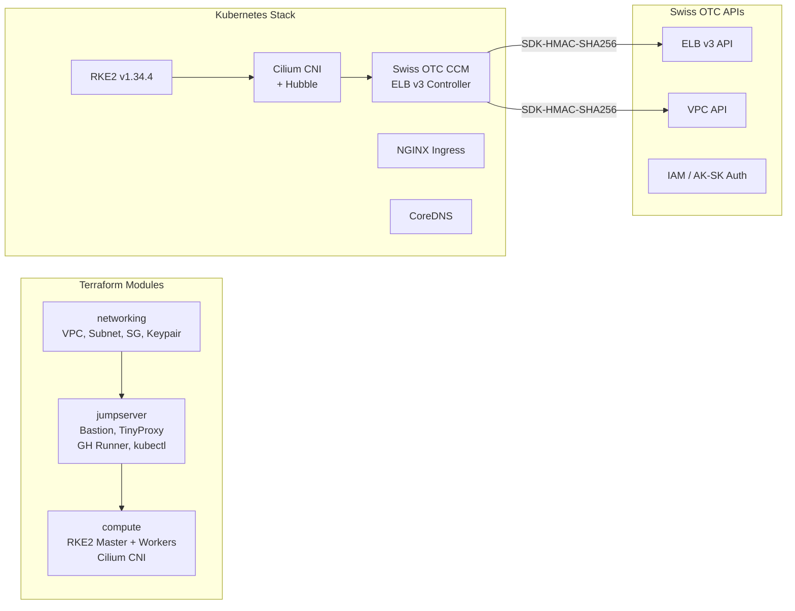
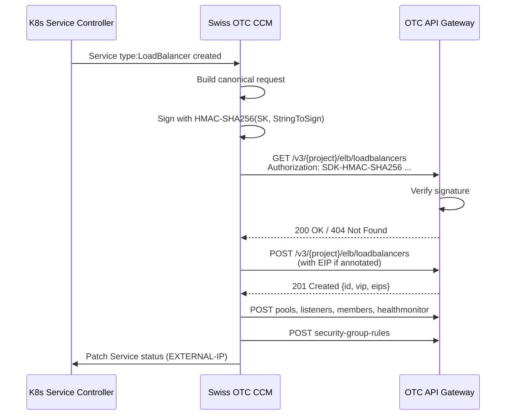
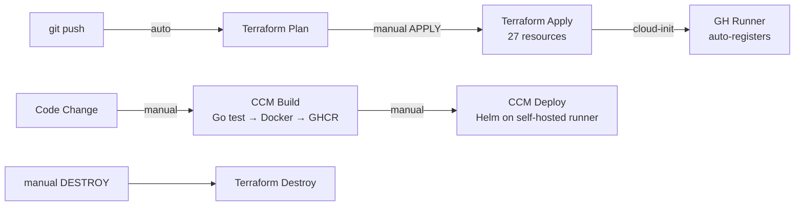

# Swiss OTC RKE2 Architecture

## Network Design

## Component Stack

## Authentication Flow

## GitOps Pipeline

## Key Design Decisions

| Decision | Rationale |
|---|---|
| AK/SK over password auth | Stateless, no token lifecycle, CI/CD best practice |
| Self-hosted runner on bastion | Direct cluster access, no SSH tunnels needed |
| Runner bootstraps via cloud-init | Fully automated, no manual setup after apply |
| TinyProxy over NAT Gateway | IAM user lacks NAT Admin permissions |
| ELB v3 from scratch | Swiss OTC eu-ch2 only supports v3 Dedicated, no existing CCM |
| Separate subnet IDs in config | OTC requires Neutron subnet ID ≠ VPC subnet ID |
| Mermaid diagrams | Native GitHub rendering, no external tools |
