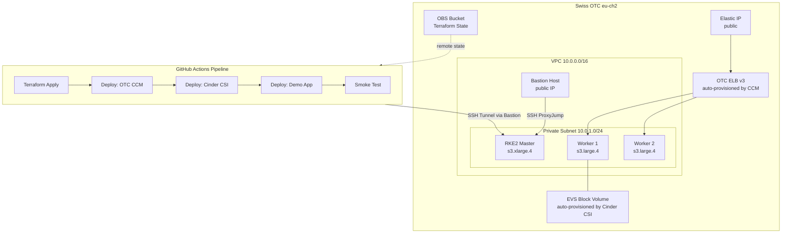
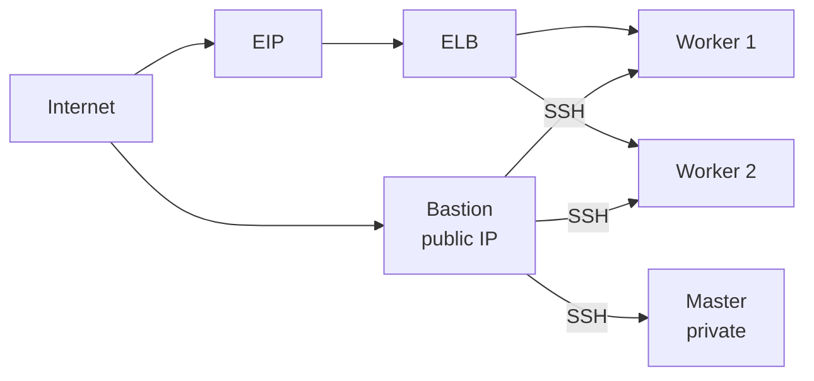
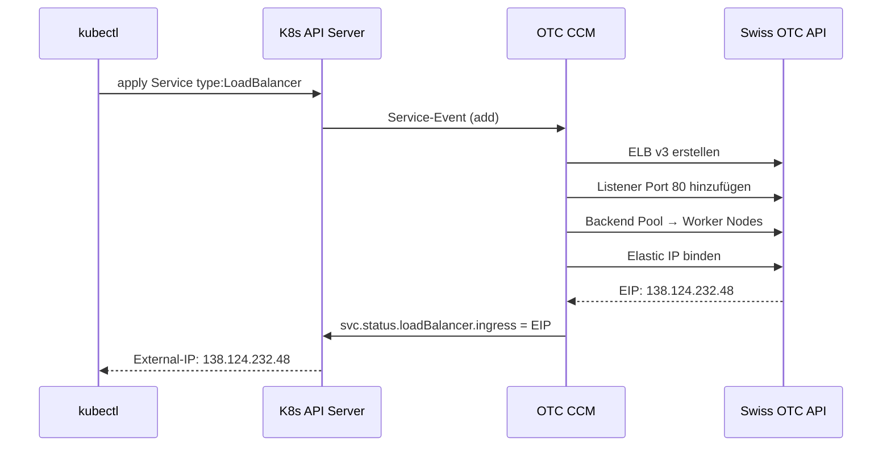
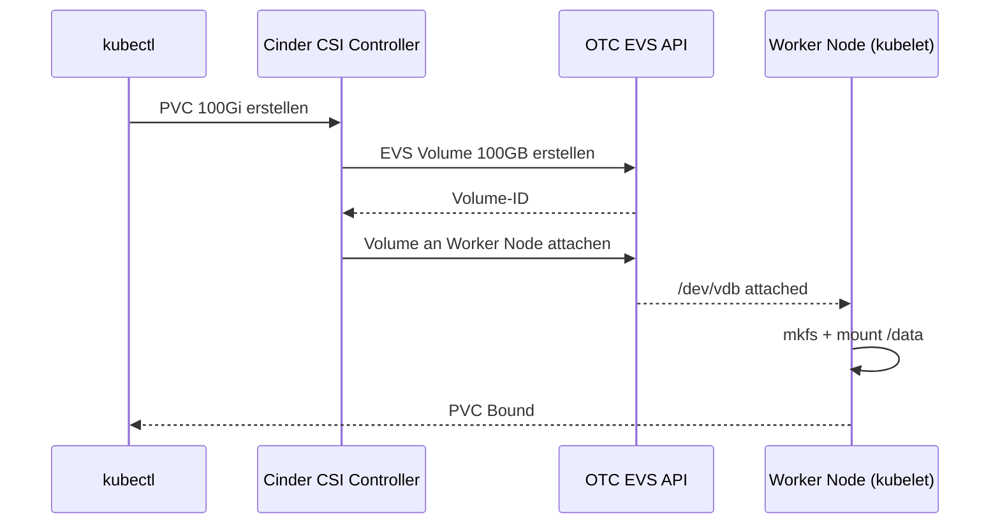
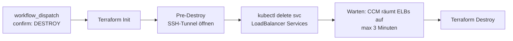

# Architecture — RKE2 Cloud-Native Stack auf Swiss OTC

## Überblick

Dieser Stack baut ein vollständiges, cloud-natives Kubernetes auf der Swiss Open Telekom Cloud (Region `eu-ch2`) auf. Alle Infrastruktur-Ressourcen werden **ausschließlich über GitHub Actions Pipelines** verwaltet — keine manuellen OTC API Calls.

## Gesamtarchitektur



---

## Komponenten im Detail

### 1. Netzwerk (Terraform)



- **VPC**: `10.0.0.0/16`
- **Subnet**: `10.0.1.0/24` (private, kein direktes Internet)
- **Bastion**: einziger Eintrittspunkt, Public IP via EIP
- **Security Groups**: Bastion (22/tcp public), Cluster (intern + ELB-Ports)

### 2. RKE2 Kubernetes

RKE2 ist eine gehärtete Kubernetes-Distribution von Rancher.

| Node | Rolle | Flavor |
|------|-------|--------|
| `rke2-dev-master` | control-plane + etcd | s3.xlarge.4 |
| `rke2-dev-worker-1` | worker | s3.large.4 |
| `rke2-dev-worker-2` | worker | s3.large.4 |

```
Kubernetes:  v1.34.5+rke2r1
CNI:         Cilium (eBPF-basiert, kein kube-proxy)
kubeconfig:  /etc/rancher/rke2/rke2.yaml (auf Master)
kubectl:     /var/lib/rancher/rke2/bin/kubectl
```

**Warum RKE2?**
- Security-first (CIS Benchmark compliant by default)
- Bundled: containerd, etcd, CoreDNS, Cilium, Ingress
- Einfaches Bootstrap via cloud-init

### 3. OTC Cloud Controller Manager (CCM)

Der CCM ist die Brücke zwischen Kubernetes und der OTC Cloud-API für **Elastic Load Balancer**.



**Auth**: AK/SK (HMAC-SHA256, kein Token-Refresh nötig)

**cloud.conf** (YAML):
```yaml
auth:
  auth_url: https://iam-pub.eu-ch2.sc.otc.t-systems.com/v3
  access_key: <AK>
  secret_key: <SK>
  project_id: <PROJECT_ID>
region: eu-ch2
network:
  vpc_id: <VPC_ID>
  subnet_id: <SUBNET_ID>
  network_id: <NETWORK_ID>
loadbalancer:
  availability_zones:
    - eu-ch2a
metadata:
  cluster_id: rke2-dev
```

**Service Annotations**:
```yaml
metadata:
  annotations:
    otc.io/eip-bandwidth: "5"           # Bandwidth in Mbit/s
    otc.io/elb-virsubnet-id: "<ID>"     # Subnet für ELB
spec:
  type: LoadBalancer
```

### 4. Cinder CSI — EVS Block Storage

Der Cinder CSI Driver ermöglicht `PersistentVolumeClaims` die automatisch OTC EVS Block Volumes erstellen.



**Auth**: Username/Password über OpenStack Keystone (OTC IAM)

**cloud.conf** (INI):
```ini
[Global]
auth-url=https://iam-pub.eu-ch2.sc.otc.t-systems.com/v3
username=<IAM_USER>
password=<IAM_PASSWORD>
region=eu-ch2
tenant-id=<PROJECT_ID>
domain-name=<DOMAIN_NAME>
```

**StorageClasses**:

| Name | Reclaim | Default | Use case |
|------|---------|---------|----------|
| `csi-cinder-sc-delete` | Delete | ✅ | Entwicklung, temporäre Daten |
| `csi-cinder-sc-retain` | Retain | ❌ | Produktion, persistente Daten |

**Beispiel PVC**:
```yaml
apiVersion: v1
kind: PersistentVolumeClaim
metadata:
  name: my-data
spec:
  accessModes: [ReadWriteOnce]
  storageClassName: csi-cinder-sc-delete
  resources:
    requests:
      storage: 100Gi
```

### 5. GitHub Actions Pipeline

Die Pipeline verwaltet den gesamten Lifecycle — Aufbau und Abbau.

#### infra-apply.yml

```mermaid
graph LR
    DISPATCH[workflow_dispatch\nconfirm: APPLY] --> TF_INIT[Terraform Init]
    TF_INIT --> TF_PLAN[Terraform Plan]
    TF_PLAN --> TF_APPLY[Terraform Apply\nBastion + Cluster + VPC]
    TF_APPLY --> WAIT[Wait: RKE2 Ready]
    WAIT --> TUNNEL[SSH-Tunnel\nlocalhost:16443 → Master:6443]
    TUNNEL --> CCM[Helm: OTC CCM\nkube-system]
    CCM --> CSI[Helm: Cinder CSI\nkube-system]
    CSI --> DEMO[kubectl: Demo App\ndefault]
    DEMO --> ELB_WAIT[Wait: ELB External-IP]
    ELB_WAIT --> SMOKE[Smoke Test HTTP 200]
```



#### infra-destroy-v2.yml



> **Wichtig**: LoadBalancer Services **müssen vor `terraform destroy`** gelöscht werden. Sonst blockieren OTC ELBs die Subnet-Deletion.

---

## SSH-Zugriff

Die Worker Nodes haben keine Public IP. Zugriff nur über Bastion:

```bash
# Direkt auf Master
ssh -J ubuntu@<BASTION_IP> ubuntu@<MASTER_IP>

# kubectl lokal via SSH-Tunnel
ssh -L 16443:<MASTER_IP>:6443 ubuntu@<BASTION_IP> -N &
kubectl --kubeconfig rke2.yaml --insecure-skip-tls-verify get nodes
```

---

## Secrets & Credentials

Alle Secrets werden als **GitHub Actions Secrets** (Environment: `production`) hinterlegt.

| Secret | Verwendung | Auth-Typ |
|--------|-----------|----------|
| `OTC_ACCESS_KEY` | Terraform + CCM | AK/SK |
| `OTC_SECRET_KEY` | Terraform + CCM | AK/SK |
| `OTC_PROJECT_ID` | Alle OTC API Calls | - |
| `OTC_USERNAME` | Cinder CSI | Keystone |
| `OTC_PASSWORD` | Cinder CSI | Keystone |
| `OTC_DOMAIN_NAME` | Cinder CSI | Keystone |
| `RKE2_TOKEN` | RKE2 Join Token | - |
| `SSH_PRIVATE_KEY` | SSH Bastion + Master | - |
| `SSH_PUBLIC_KEY` | Deployed auf VMs | - |
| `GHCR_PULL_TOKEN` | CCM Image Pull | read:packages |
| `GH_PAT` | GitHub API | repo+workflow |

---

## Terraform State

Remote State in OTC OBS (S3-kompatibel):

```hcl
terraform {
  backend "s3" {
    bucket   = "rke2-sotc-tfstate"
    key      = "rke2/terraform.tfstate"
    region   = "eu-ch2"
    endpoint = "https://obs.eu-ch2.otc.t-systems.com"
    # AK/SK via Env: AWS_ACCESS_KEY_ID / AWS_SECRET_ACCESS_KEY
  }
}
```

---

## Warum welche Auth-Methode?

| Komponente | Auth | Warum |
|-----------|------|-------|
| Terraform | AK/SK | Stateless, kein Token-Refresh, ideal für CI |
| OTC CCM | AK/SK | Langlebiger Controller, kein Token-Ablauf |
| Cinder CSI | Username/Password | openstack-cinder-csi unterstützt kein AK/SK nativ |
| kubectl (lokal) | kubeconfig | Standard K8s |

---

## Reproduzierbarkeit: Destroy & Rebuild

Der komplette Stack ist **idempotent**:

```bash
# 1. Alles löschen
GitHub Actions → infra-destroy-v2.yml → confirm: DESTROY

# 2. Neu aufbauen
GitHub Actions → infra-apply.yml → confirm: APPLY
# → terraform apply → CCM → Cinder CSI → Demo App → HTTP 200 ✅
```

Neue IPs werden automatisch vergeben, alle Komponenten konfigurieren sich selbst neu.
