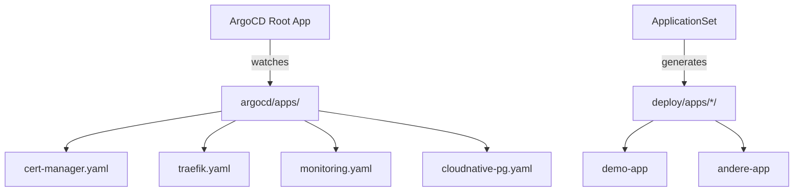

# ArgoCD — GitOps Application Delivery

## Übersicht
ArgoCD implementiert das GitOps-Prinzip: **Git ist die einzige Source of Truth**.
Cluster-Zustand = Git-Repository-Zustand. Jede Abweichung wird automatisch korrigiert.

## GitOps Best Practices

### 1. App-of-Apps Pattern



Die **Root App** (`argocd/apps/root.yaml`) managed alle anderen Apps.
Neue App hinzufügen = YAML in `argocd/apps/` commiten. Das war's.

### 2. AppProjects (Isolation)

| Project | Scope | Repos |
|---|---|---|
| `infrastructure` | Cluster-wide (CRDs, ClusterRoles) | alle |
| `workloads` | Namespaced only | Wolfslight-Forgehouse/* |

### 3. ApplicationSet (Skalierung)

`argocd/appsets/workloads-appset.yaml` generiert automatisch eine ArgoCD App
für jedes Verzeichnis unter `deploy/apps/`. Neue App deployen:

```bash
mkdir deploy/apps/meine-app
# YAML Manifeste reinlegen
git add deploy/apps/meine-app/
git commit -m "feat: meine-app hinzugefügt"
git push
# ArgoCD deployed automatisch!
```

### 4. Sync Policies (Empfehlung)

```yaml
syncPolicy:
  automated:
    prune: true      # Entfernte Ressourcen löschen
    selfHeal: true   # Manuelle Änderungen rückgängig machen
  syncOptions:
    - CreateNamespace=true
    - ServerSideApply=true  # Für CRDs wichtig
```

### 5. Secrets — NIEMALS in Git

```bash
# Sealed Secrets (empfohlen)
kubeseal --format yaml < my-secret.yaml > sealed-secret.yaml
git add sealed-secret.yaml  # ✅ sicher

# Oder: External Secrets Operator mit 1Password/Vault
```

## Struktur im Repo

```
argocd/
  apps/           # App-of-Apps: ein YAML pro Komponente
    root.yaml       # Root App (managed alle anderen)
    cert-manager.yaml
    traefik.yaml
    monitoring.yaml
    cloudnative-pg.yaml
  projects/       # AppProject-Definitionen
    infrastructure.yaml
    workloads.yaml
  appsets/        # ApplicationSets für automatische App-Generierung
    workloads-appset.yaml
deploy/
  apps/           # Workload-Manifeste (von ApplicationSet gescannt)
    demo-app/
```

## Bootstrap (einmalig nach Cluster-Create)

```bash
# ArgoCD installieren (via Pipeline)
# Dann Root App bootstrappen:
kubectl apply -f argocd/projects/infrastructure.yaml
kubectl apply -f argocd/projects/workloads.yaml
kubectl apply -f argocd/apps/root.yaml
kubectl apply -f argocd/appsets/workloads-appset.yaml
```

Danach managed ArgoCD sich selbst und alle anderen Apps via Git.

## Zugang

- **URL:** http://argocd.local (via Traefik Ingress)
- **Username:** `admin`
- **Password:** `kubectl get secret argocd-initial-admin-secret -n argocd -o jsonpath='{.data.password}' | base64 -d`

## Jira
Ticket: SDE-278
