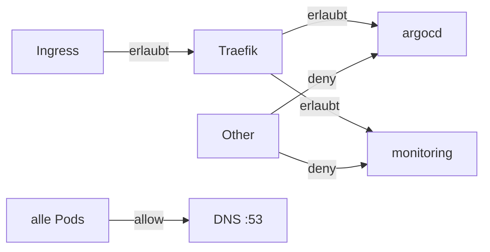

# CIS Hardening — Swiss OTC RKE2 Cluster

## Übersicht CIS Benchmark Score

| Kategorie | Score (Ziel) | Methode |
|---|---|---|
| PASS | ≥ 55/91 | Automatisiert |
| WARN | ≤ 30/91 | Kyverno + NetworkPolicies |
| FAIL | 0/91 | chmod + RKE2 Flags |

## Implementierte Fixes

### 1. Datei-Permissions (CIS 1.1.1, 1.1.3, 1.1.5, 1.1.9, 1.1.10, 1.1.20)
`rke2-cis-fix.service` — systemd OneShot nach RKE2-Start:
- `chmod 600` auf alle YAML/CONF unter `/etc/rancher/rke2/`
- `chmod 600` auf TLS Certs in `/var/lib/rancher/rke2/server/tls/`
- `chmod 600 + chown root:root` auf CNI Config unter `/var/lib/rancher/rke2/agent/etc/cni/`

### 2. RKE2 API-Server Flags (CIS 1.2.1, 1.2.9)
In `/etc/rancher/rke2/config.yaml`:
```yaml
kube-apiserver-arg:
  - "anonymous-auth=false"
  - "enable-admission-plugins=NodeRestriction,EventRateLimit"
  - "admission-control-config-file=/etc/rancher/rke2/admission-control-config.yaml"
```

### 3. NetworkPolicies — Default-Deny (CIS 5.3.2)
Default-Deny für alle Application-Namespaces:



### 4. Kyverno Policy Engine (CIS 5.2.*, 5.7.*)
Audit-Mode Policies (kein Enforcement — kein Breaking-Change):

| Policy | CIS Control | Beschreibung |
|---|---|---|
| `disallow-privileged-containers` | 5.2.2 | Kein `privileged: true` |
| `disallow-host-pid` | 5.2.3 | Kein `hostPID: true` |
| `disallow-host-network` | 5.2.5 | Kein `hostNetwork: true` |
| `disallow-privilege-escalation` | 5.2.6 | `allowPrivilegeEscalation: false` |
| `require-seccomp-profile` | 5.7.2 | `seccompProfile: RuntimeDefault` |

> **Audit-Mode**: Policies loggen Violations, blockieren aber nicht.
> Für Enforcement: `validationFailureAction: Enforce` setzen.

## Kyverno Reports lesen

```bash
# Policy Reports
kubectl get policyreport -A
kubectl get clusterpolicyreport

# Violations anzeigen
kubectl get policyreport -A -o json | \
  jq '.items[].results[] | select(.result=="fail") | .message'
```

## Verbleibende WARNs (nicht automatisierbar)

| Check | Grund |
|---|---|
| 5.1.1–13 | RBAC Review — manuell, organisatorisch |
| 5.4.2 | External Secrets — optionales Ticket (Vault/1Password) |
| 5.5.1 | ImagePolicyWebhook — optional, hoher Aufwand |
| 1.2.11 | AlwaysPullImages — Performance-Abwägung |
| 1.2.12 | SecurityContextDeny — deprecated in K8s 1.30+ |

## CIS Scan ausführen

```bash
# Standalone (ohne Redeploy)
# GitHub Actions → CIS Benchmark Scan → confirm: SCAN
```

Tickets: SDE-284, SDE-285, SDE-286
