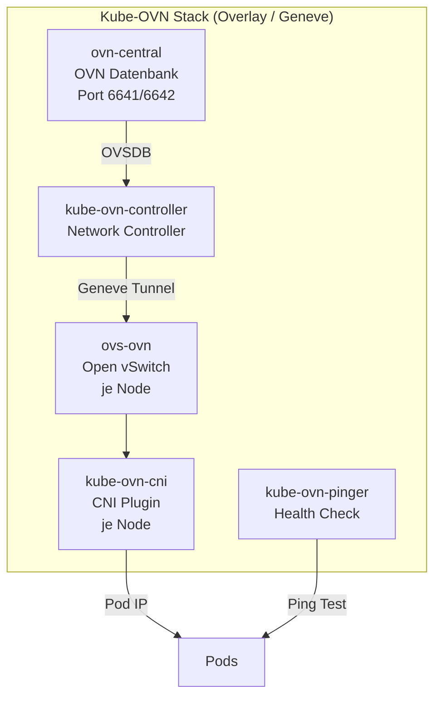

# Kube-OVN CNI — Swiss OTC RKE2

## Überblick

Kube-OVN ist als schaltbare Alternative zu Cilium implementiert. Steuerung via GitHub Repository Variable `CNI_PLUGIN`.

## Aktivierung

```bash
# GitHub Repository Variable setzen
CNI_PLUGIN=kube-ovn   # Kube-OVN (Geneve Overlay)
CNI_PLUGIN=cilium     # Cilium (default)
```

## Architektur



## Konfiguration

| Parameter | Wert |
|-----------|------|
| Version | `kubeovn/kube-ovn v1.13.0` |
| Network Type | `geneve` (Overlay) |
| Pod Subnet | `10.244.0.0/16` |
| Join Subnet | `100.64.0.0/16` |
| NP Implementation | `iptables` |
| Master Label | `kube-ovn/role=master` |

## Bekannte Bootstrap-Probleme & Fixes

### Problem: ovn-central Pending (Bootstrap Deadlock)

**Symptom:**
```
Warning  FailedScheduling  0/3 nodes are available: 
  3 node(s) didn't match Pod's node affinity/selector
```

**Root Cause:**  
Kube-OVN nutzt `nodeSelector: kube-ovn/role=master` für den `ovn-central` Pod.
Dieses Label wird **nicht automatisch** gesetzt — RKE2 setzt es nicht.

**Fix:**  
```bash
# Master-Node labeln vor Helm install
kubectl label node <master-node-name> kube-ovn/role=master --overwrite
```

Im Pipeline-Workflow wird der Master automatisch ermittelt und gelabelt:
```bash
MASTER_HOSTNAME=$(kubectl get nodes \
  -o jsonpath='{.items[?(@.metadata.labels.node-role\.kubernetes\.io/control-plane)].metadata.name}' \
  | awk '{print $1}')
kubectl label node "$MASTER_HOSTNAME" kube-ovn/role=master --overwrite
```

### Problem: Insufficient CPU (s3.large.2 / s3.xlarge.4)

**Symptom:**
```
Warning  FailedScheduling  1 Insufficient cpu, 2 node(s) didn't match selector
```

**Root Cause:**  
`ovn-central` default CPU Request = `300m`. Auf kleinen Nodes (s3.large.2 = 2 vCPU)
zu hoch wenn andere System-Pods laufen.

**Fix:**  
```bash
kubectl patch deployment ovn-central -n kube-system \
  --type strategic \
  --patch '{"spec":{"template":{"spec":{"containers":[{
    "name":"ovn-central",
    "resources":{
      "requests":{"cpu":"100m","memory":"100Mi"},
      "limits":{"cpu":"1","memory":"1Gi"}
    }
  }]}}}}'
```

### Problem: CrashLoopBackOff nach vielen Restarts (MaxBackoff)

**Symptom:**  
CNI Pods zeigen `CrashLoopBackOff` mit 80+ Restarts, obwohl ovn-central jetzt läuft.
Kubernetes wartet bis zu 5 Minuten zwischen Restarts (exponential backoff).

**Fix:**  
Pods löschen → DaemonSet/Deployment erstellt sie frisch ohne Backoff:
```bash
kubectl delete pods -n kube-system -l app=kube-ovn-cni
kubectl delete pods -n kube-system -l app=kube-ovn-controller
```

## Overlay vs Underlay

| | Overlay (Geneve) | Underlay (OTC VPC) |
|---|---|---|
| **OTC Routing** | ✅ Nicht nötig | ❌ VPC Routes pro Node |
| **Network Policies** | ✅ Vollständig | ✅ Vollständig |
| **Pod IPs** | Eigenes Subnet | Direkte VPC IPs |
| **MTU Overhead** | ~50 bytes (Geneve) | Keiner |
| **OTC Neutron** | ✅ Keine Änderung | ❌ Port-Security anpassen |
| **Installation** | ✅ Einfach | ❌ Aufwändig |
| **Empfehlung** | ✅ **Production-ready** | Nur bei speziellen Anforderungen |

## Troubleshooting

```bash
# Pod-Status
kubectl get pods -n kube-system | grep -E "ovn|kube-ovn"

# ovn-central Logs
kubectl logs -n kube-system deployment/ovn-central

# Controller Logs
kubectl logs -n kube-system deployment/kube-ovn-controller

# CNI Logs auf Node
kubectl logs -n kube-system -l app=kube-ovn-cni --all-containers

# Scheduling Events
kubectl describe pod ovn-central-xxx -n kube-system | grep -A10 Events

# Node Labels prüfen
kubectl get nodes --show-labels | grep kube-ovn
```
