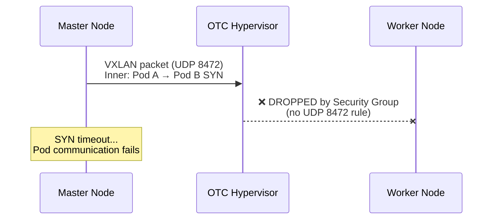

# OTC Networking Requirements for Kubernetes

> **This document explains a critical networking issue that affects ALL Kubernetes clusters on Open Telekom Cloud (OTC) using overlay networking (VXLAN/Geneve).**

## The Problem

By default, OTC Security Groups only include TCP rules for Kubernetes ports. **The VXLAN overlay port (UDP 8472) is NOT included**, which causes:

- ❌ Cross-node pod communication fails
- ❌ NodePort only works when the target pod is on the same node
- ❌ ELB health checks intermittently fail (only succeed when hitting local pods)
- ❌ DNS resolution fails for pods on remote nodes

## Root Cause

Kubernetes overlay networks (Flannel, Cilium, Calico VXLAN) encapsulate pod-to-pod traffic in **VXLAN tunnels using UDP port 8472**. OTC Security Groups operate at the hypervisor level and silently drop UDP 8472 packets when no ingress rule exists.

### What happens:



### What it looks like from inside the cluster:

```bash
# On master: VXLAN packets are sent
$ tcpdump -i enp0s3 udp port 8472
10.0.1.130 > 10.0.1.220: OTV ... IP 10.42.0.103 > 10.42.2.19: SYN  ✅ Sent

# On worker: NOTHING arrives
$ tcpdump -i enp0s3 udp port 8472
(no packets captured)  ❌ Never received
```

## Required Security Group Rules

### Minimum rules for any Kubernetes cluster on OTC:

| Direction | Protocol | Port Range | Source | Purpose |
|---|---|---|---|---|
| Ingress | TCP | 22 | 0.0.0.0/0 | SSH access |
| Ingress | TCP | 6443 | 10.0.0.0/16 | Kubernetes API |
| Ingress | TCP | 2379-2380 | 10.0.0.0/16 | etcd |
| Ingress | TCP | 9345 | 10.0.0.0/16 | RKE2 Supervisor |
| Ingress | TCP | 10250 | 10.0.0.0/16 | Kubelet |
| Ingress | TCP | 30000-32767 | 10.0.0.0/16 | NodePorts |
| Ingress | TCP | 30000-32767 | 100.125.0.0/16 | ELB SNAT to NodePorts |
| **Ingress** | **UDP** | **8472** | **10.0.0.0/16** | **VXLAN overlay (Flannel/Cilium)** |
| Ingress | UDP | 4789 | 10.0.0.0/16 | GENEVE overlay (alternative) |
| Ingress | ICMP | - | 10.0.0.0/16 | Debugging / health checks |

> ⚠️ **The UDP 8472 rule is the most commonly missed rule.** Without it, your cluster will appear to work (API, SSH, etc.) but pod networking across nodes will be completely broken.

### Adding the missing rule via OTC API:

```bash
curl -X POST -H "X-Auth-Token: $TOKEN" -H "Content-Type: application/json" \
  "https://vpc.eu-ch2.sc.otc.t-systems.com/v1/$PROJECT_ID/security-group-rules" \
  -d '{
    "security_group_rule": {
      "security_group_id": "YOUR_SG_ID",
      "direction": "ingress",
      "protocol": "udp",
      "port_range_min": 8472,
      "port_range_max": 8472,
      "remote_ip_prefix": "10.0.0.0/16"
    }
  }'
```

## Recommended CNI: Cilium

We recommend **Cilium** over Canal (Calico + Flannel) for OTC deployments:

### Why Cilium?

- **eBPF-based:** Replaces kube-proxy entirely, better performance
- **Hubble:** Built-in network observability
- **kube-proxy replacement:** No iptables/nftables complexity
- **L3-L7 Network Policies:** More granular than Calico
- **Better debugging:** `cilium status`, `cilium monitor`

### RKE2 + Cilium Configuration

Master `/etc/rancher/rke2/config.yaml`:
```yaml
token: YOUR_CLUSTER_TOKEN
cloud-provider-name: external
tls-san:
  - MASTER_IP
cni: cilium
disable-kube-proxy: true
```

Worker `/etc/rancher/rke2/config.yaml`:
```yaml
server: https://MASTER_IP:9345
token: YOUR_CLUSTER_TOKEN
cloud-provider-name: external
cni: cilium
```

Cilium HelmChartConfig (`/var/lib/rancher/rke2/server/manifests/rke2-cilium-config.yaml`):
```yaml
apiVersion: helm.cattle.io/v1
kind: HelmChartConfig
metadata:
  name: rke2-cilium
  namespace: kube-system
spec:
  valuesContent: |-
    kubeProxyReplacement: true
    k8sServiceHost: MASTER_IP
    k8sServicePort: 6443
    MTU: 1450
    hubble:
      enabled: true
      relay:
        enabled: true
    operator:
      replicas: 1
```

> **Important:** `k8sServiceHost` must point to the actual API server IP (not ClusterIP). Without this, Cilium cannot bootstrap when kube-proxy is disabled (chicken-and-egg problem).

> **MTU 1450:** VXLAN adds 50 bytes overhead. With OTC's default MTU of 1500, the inner packet MTU must be 1450 to avoid fragmentation.

## Debugging Cross-Node Connectivity

### Step 1: Verify VXLAN port is open

```bash
# From node A, check if UDP 8472 reaches node B
nc -zuv NODE_B_IP 8472

# Expected: "Connection ... succeeded!" 
# If timeout: Security Group is blocking UDP 8472
```

### Step 2: tcpdump on both sides

```bash
# On sending node:
tcpdump -i enp0s3 udp port 8472 -nn

# On receiving node (simultaneously):
tcpdump -i enp0s3 udp port 8472 -nn

# If sender shows packets but receiver doesn't → SG issue
```

### Step 3: Test with a real listener

```bash
# Start netcat on an unused NodePort on the target node:
nc -l -p 30999

# From another node:
echo "test" | nc -w3 TARGET_IP 30999

# If this works but NodePort doesn't → kube-proxy/Cilium routing issue
# If this also fails → Security Group or network issue
```

### Step 4: Verify pod routing

```bash
# Direct pod access (bypasses NodePort/kube-proxy):
curl http://POD_IP:80

# If local pod works but remote pod doesn't → overlay issue
# If both work → NodePort/kube-proxy issue
```

## Migration from Canal to Cilium

1. Stop all workers, then master
2. Update config files (add `cni: cilium`, `disable-kube-proxy: true`)
3. Clean old CNI state:
   ```bash
   rm -rf /etc/cni/net.d/* /var/lib/cni/ /run/flannel/ /var/lib/calico/
   ip link delete flannel.1 2>/dev/null
   ip link delete cni0 2>/dev/null
   ```
4. Remove old manifests: `rm -f /var/lib/rancher/rke2/server/manifests/rke2-canal*`
5. Start master, wait for Cilium pods, then start workers
6. Verify: `kubectl get pods -n kube-system -l k8s-app=cilium`
