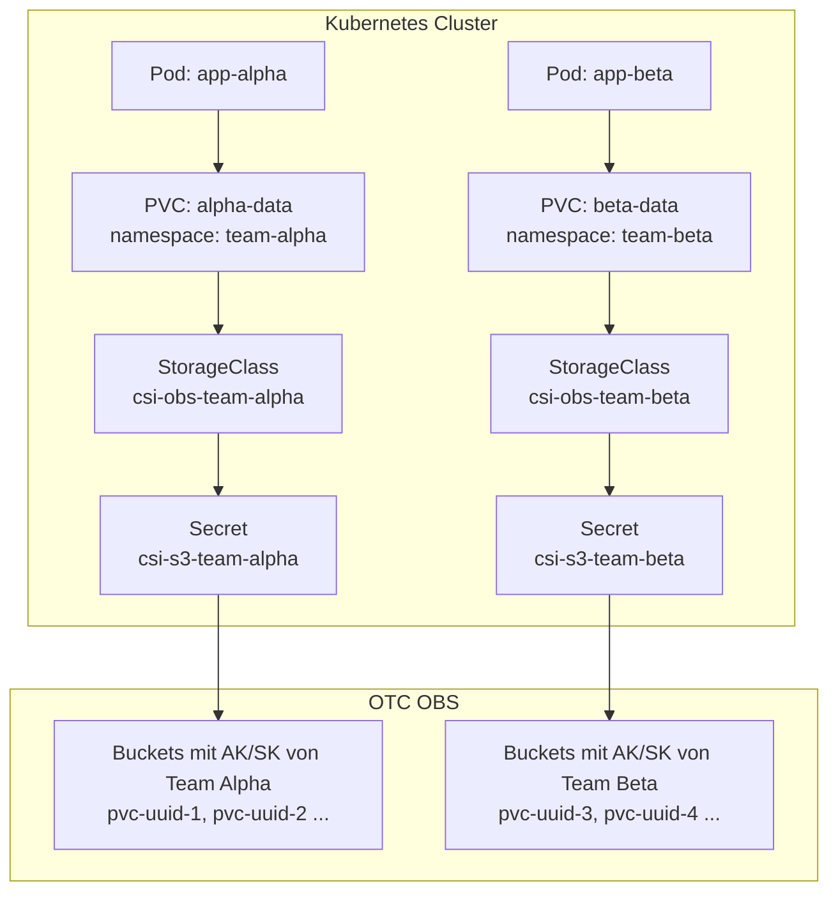

# OBS Multi-Tenant Storage — Step by Step Guide

Dieser Guide erklärt wie mehrere Teams / Tenants **isolierten S3-Storage** auf OTC OBS
via Kubernetes PVCs nutzen können — mit eigenen Credentials und eigenen Buckets.

---

## Konzept



**Jedes Team bekommt:**
- Eigenen OTC IAM User mit AK/SK
- Eigene OBS Buckets (automatisch erstellt per PVC)
- Eigene StorageClass → kein Zugriff auf fremde Buckets möglich

---

## Schritt 1: OTC IAM User pro Team erstellen

Im OTC Console (oder via API) für jedes Team einen IAM User anlegen:

1. **OTC Console → IAM → Users → Create User**
2. Name: `k8s-storage-team-alpha`
3. Access Type: **Programmatic access** (AK/SK)
4. Gruppe / Berechtigungen: `OBS OperateAccess` (oder eigene Policy)
5. AK/SK notieren

> 💡 **Minimale OBS Policy** (nur eigene Buckets):
> ```json
> {
>   "Statement": [{
>     "Effect": "Allow",
>     "Action": ["obs:bucket:*", "obs:object:*"],
>     "Resource": ["obs:*:*:bucket:k8s-alpha-*", "obs:*:*:object:k8s-alpha-*/*"]
>   }]
> }
> ```

---

## Schritt 2: Kubernetes Secrets erstellen

Für jedes Team ein Secret im `kube-system` Namespace anlegen:

```bash
# Team Alpha
kubectl create secret generic csi-s3-team-alpha \
  --namespace kube-system \
  --from-literal=accessKeyID=<TEAM_ALPHA_AK> \
  --from-literal=secretAccessKey=<TEAM_ALPHA_SK> \
  --from-literal=endpoint=https://obs.eu-ch2.sc.otc.t-systems.com \
  --from-literal=region=eu-ch2

# Team Beta
kubectl create secret generic csi-s3-team-beta \
  --namespace kube-system \
  --from-literal=accessKeyID=<TEAM_BETA_AK> \
  --from-literal=secretAccessKey=<TEAM_BETA_SK> \
  --from-literal=endpoint=https://obs.eu-ch2.sc.otc.t-systems.com \
  --from-literal=region=eu-ch2
```

Verifizieren:
```bash
kubectl get secrets -n kube-system | grep csi-s3
# csi-s3-team-alpha   Opaque   4      5s
# csi-s3-team-beta    Opaque   4      3s
```

---

## Schritt 3: StorageClasses erstellen

Jede StorageClass verweist auf das zugehörige Team-Secret:

```yaml
# deploy/k8s/storage/storageclasses-multi-tenant.yaml

---
apiVersion: storage.k8s.io/v1
kind: StorageClass
metadata:
  name: csi-obs-team-alpha
  annotations:
    storageclass.kubernetes.io/description: "OTC OBS für Team Alpha (isoliert)"
provisioner: ru.yandex.s3.csi
reclaimPolicy: Delete
volumeBindingMode: Immediate
parameters:
  mounter: geesefs
  options: "--memory-limit 1000 --dir-mode 0777 --file-mode 0666"
  # Secret-Referenzen — alle 3 müssen gesetzt sein
  csi.storage.k8s.io/provisioner-secret-name: csi-s3-team-alpha
  csi.storage.k8s.io/provisioner-secret-namespace: kube-system
  csi.storage.k8s.io/controller-publish-secret-name: csi-s3-team-alpha
  csi.storage.k8s.io/controller-publish-secret-namespace: kube-system
  csi.storage.k8s.io/node-stage-secret-name: csi-s3-team-alpha
  csi.storage.k8s.io/node-stage-secret-namespace: kube-system
  csi.storage.k8s.io/node-publish-secret-name: csi-s3-team-alpha
  csi.storage.k8s.io/node-publish-secret-namespace: kube-system

---
apiVersion: storage.k8s.io/v1
kind: StorageClass
metadata:
  name: csi-obs-team-beta
  annotations:
    storageclass.kubernetes.io/description: "OTC OBS für Team Beta (isoliert)"
provisioner: ru.yandex.s3.csi
reclaimPolicy: Delete
volumeBindingMode: Immediate
parameters:
  mounter: geesefs
  options: "--memory-limit 1000 --dir-mode 0777 --file-mode 0666"
  csi.storage.k8s.io/provisioner-secret-name: csi-s3-team-beta
  csi.storage.k8s.io/provisioner-secret-namespace: kube-system
  csi.storage.k8s.io/controller-publish-secret-name: csi-s3-team-beta
  csi.storage.k8s.io/controller-publish-secret-namespace: kube-system
  csi.storage.k8s.io/node-stage-secret-name: csi-s3-team-beta
  csi.storage.k8s.io/node-stage-secret-namespace: kube-system
  csi.storage.k8s.io/node-publish-secret-name: csi-s3-team-beta
  csi.storage.k8s.io/node-publish-secret-namespace: kube-system
```

Anwenden:
```bash
kubectl apply -f deploy/k8s/storage/storageclasses-multi-tenant.yaml

kubectl get sc | grep csi-obs
# csi-obs              ru.yandex.s3.csi   Delete   Immediate   false   (default)
# csi-obs-team-alpha   ru.yandex.s3.csi   Delete   Immediate   false
# csi-obs-team-beta    ru.yandex.s3.csi   Delete   Immediate   false
```

---

## Schritt 4: PVCs in Team-Namespaces erstellen

```bash
# Namespaces anlegen
kubectl create namespace team-alpha
kubectl create namespace team-beta
```

```yaml
# Team Alpha PVC
apiVersion: v1
kind: PersistentVolumeClaim
metadata:
  name: alpha-shared-data
  namespace: team-alpha
spec:
  accessModes: [ReadWriteMany]
  storageClassName: csi-obs-team-alpha
  resources:
    requests:
      storage: 50Gi
```

```bash
kubectl apply -f alpha-pvc.yaml
kubectl get pvc -n team-alpha
# NAME                STATUS   VOLUME            CAPACITY   ACCESS MODES   STORAGECLASS
# alpha-shared-data   Bound    pvc-<uuid>        50Gi       RWX            csi-obs-team-alpha
```

> 🔒 **Isolation:** Der OBS Bucket wird mit den AK/SK von Team Alpha erstellt.
> Team Beta kann ihn nicht lesen, da es andere Credentials hat.

---

## Schritt 5: Pod mit PVC deployen

```yaml
apiVersion: apps/v1
kind: Deployment
metadata:
  name: app-alpha
  namespace: team-alpha
spec:
  replicas: 2  # ReadWriteMany → mehrere Pods möglich!
  selector:
    matchLabels:
      app: app-alpha
  template:
    metadata:
      labels:
        app: app-alpha
    spec:
      containers:
      - name: app
        image: nginx:alpine
        volumeMounts:
        - name: obs-storage
          mountPath: /data
      volumes:
      - name: obs-storage
        persistentVolumeClaim:
          claimName: alpha-shared-data
```

---

## Option: singleBucket (fixierter Bucket, Subdirs pro PVC)

Günstiger wenn viele kleine PVCs: alle PVCs landen im gleichen Bucket, aber in separaten Unterverzeichnissen.

```yaml
apiVersion: storage.k8s.io/v1
kind: StorageClass
metadata:
  name: csi-obs-team-alpha-shared
provisioner: ru.yandex.s3.csi
parameters:
  mounter: geesefs
  options: "--memory-limit 1000"
  # Fixierter Bucket — Unterordner werden automatisch erstellt
  singleBucket: "k8s-alpha-shared-bucket"
  csi.storage.k8s.io/provisioner-secret-name: csi-s3-team-alpha
  csi.storage.k8s.io/provisioner-secret-namespace: kube-system
  csi.storage.k8s.io/node-stage-secret-name: csi-s3-team-alpha
  csi.storage.k8s.io/node-stage-secret-namespace: kube-system
  csi.storage.k8s.io/node-publish-secret-name: csi-s3-team-alpha
  csi.storage.k8s.io/node-publish-secret-namespace: kube-system
```

| | Eigene Buckets (Standard) | singleBucket |
|--|--------------------------|--------------|
| Isolation | ✅ Bucket-Level | ⚠️ Verzeichnis-Level |
| OBS Kosten | Mehr Buckets | 1 Bucket pro Team |
| Buckets löschen | Automatisch (reclaimPolicy: Delete) | Manuell |
| Use Case | Prod, sensible Daten | Dev/Test, viele kleine PVCs |

---

## Sicherheitshinweise

- **Secrets in `kube-system`**: Nur Cluster-Admins können die Team-Secrets lesen
- **Namespace RBAC**: Teams bekommen nur Zugriff auf ihren eigenen Namespace
- **StorageClass RBAC**: Via ResourceQuota steuern welche StorageClass ein Namespace nutzen darf:

```yaml
apiVersion: v1
kind: ResourceQuota
metadata:
  name: storage-quota
  namespace: team-alpha
spec:
  hard:
    # Nur csi-obs-team-alpha erlaubt (nicht team-beta oder csi-cinder)
    requests.storage: "500Gi"
    csi-obs-team-alpha.storageclass.storage.k8s.io/requests.storage: "500Gi"
```

---

## Zusammenfassung

| Schritt | Was | Wer |
|---------|-----|-----|
| 1 | OTC IAM User + AK/SK pro Team | OTC Admin |
| 2 | `kubectl create secret` | Cluster Admin |
| 3 | StorageClass per Team deployen | Cluster Admin |
| 4 | PVC in Team-Namespace erstellen | Entwickler |
| 5 | PVC in Pod/Deployment mounten | Entwickler |

**Entwickler brauchen nur Schritt 4+5** — sie geben einfach `storageClassName: csi-obs-team-alpha` an und bekommen automatisch isolierten OBS Storage. 🚀
