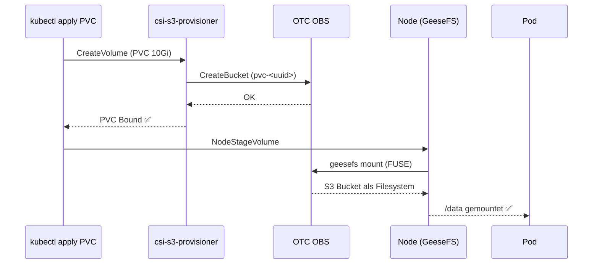

# Storage auf Swiss OTC RKE2

Zwei Storage-Backends stehen zur Verfügung:

| Feature | EVS (Block) | OBS (Object/S3) |
|---------|-------------|-----------------|
| Typ | Block Storage | Object Storage (S3-kompatibel) |
| CSI Driver | `cinder.csi.openstack.org` | `ru.yandex.s3.csi` (GeeseFS) |
| Access Mode | `ReadWriteOnce` | `ReadWriteMany` |
| Use Case | Datenbanken, stateful Apps | Shared Files, Logs, ML-Daten |
| Helm Chart | `cpo/openstack-cinder-csi` | `csi-s3/csi-s3` |
| StorageClass | `csi-cinder-sc-delete` | `csi-obs` |
| Auth | Keystone (user/pass) | AK/SK (S3) |

---

## EVS Block Storage (Cinder CSI)

Persistenter Block-Storage via OpenStack Cinder — optimal für Datenbanken.

### Deployment

```bash
# Secret erstellen (Keystone Auth)
kubectl create secret generic cinder-csi-cloud-config \
  --namespace kube-system \
  --from-file=cloud.conf=/path/to/cloud.conf

# Helm install
helm upgrade --install cinder-csi cpo/openstack-cinder-csi \
  --namespace kube-system \
  --version 2.35.0 \
  -f deploy/helm/cinder-csi/values.yaml \
  --set secret.create=false \
  --set secret.enabled=true \
  --set secret.name=cinder-csi-cloud-config
```

### cloud.conf Format (INI)

```ini
[Global]
auth-url=https://iam-pub.eu-ch2.sc.otc.t-systems.com/v3
username=<otc-username>
password=<otc-password>
region=eu-ch2
tenant-id=<project-id>
domain-name=<domain-name>
```

### StorageClasses

```yaml
# Delete (Standard)
storageClassName: csi-cinder-sc-delete

# Retain (für Prod)
storageClassName: csi-cinder-sc-retain
```

### Beispiel PVC

```yaml
apiVersion: v1
kind: PersistentVolumeClaim
metadata:
  name: postgres-data
spec:
  accessModes: [ReadWriteOnce]
  storageClassName: csi-cinder-sc-delete
  resources:
    requests:
      storage: 20Gi
```

---

## OBS Object Storage (CSI-S3 / GeeseFS)

S3-kompatibler Object Storage auf OTC OBS — optimal für shared Files, Logs, ML-Daten (ReadWriteMany).

### Funktionsweise



### Voraussetzungen (Nodes)

> ⚠️ **Wichtig:** RKE2 Nodes haben kein outbound Internet. Manuelle Installation nötig oder via cloud-init.

```bash
# geesefs binary auf Nodes installieren (via Bastion)
# Download auf ADA-Box:
curl -fsSL https://github.com/yandex-cloud/geesefs/releases/download/v0.42.4/geesefs-linux-amd64 \
  -o /tmp/geesefs

# Auf jeden Node kopieren + installieren:
scp -i <key> /tmp/geesefs ubuntu@<bastion>:/tmp/geesefs
ssh ubuntu@<bastion> "scp /tmp/geesefs ubuntu@<node-ip>:/tmp/geesefs"
ssh ubuntu@<node-ip> "sudo install /tmp/geesefs /usr/local/bin/geesefs"
```

> 💡 **Terraform TODO:** geesefs binary in OBS ablegen und via cloud-init von internem Endpoint pullen.

### CSI-S3 Image

Das Upstream-Image (`cr.yandex/...`) erfordert Yandex-Auth. Wir bauen selbst:

```bash
# Build & Push via GitHub Actions:
# .github/workflows/csi-s3-build.yml
# → ghcr.io/wolfslight-forgehouse/csi-s3-driver:latest
```

### Deployment

```bash
# Helm repo
helm repo add csi-s3 https://yandex-cloud.github.io/k8s-csi-s3/charts
helm repo update

# Install
helm upgrade --install csi-s3 csi-s3/csi-s3 \
  --namespace kube-system \
  -f deploy/helm/csi-s3/values.yaml \
  --set secret.accessKey=<AK> \
  --set secret.secretKey=<SK>

# imagePullSecrets Patch (Package ist private)
kubectl patch daemonset csi-s3 -n kube-system \
  --type=json \
  -p='[{"op":"add","path":"/spec/template/spec/imagePullSecrets","value":[{"name":"ghcr-pull-secret"}]}]'

# Provisioner socket-dir Patch (hostPath statt emptyDir)
kubectl patch statefulset csi-s3-provisioner -n kube-system \
  --type=json \
  -p='[
    {"op":"replace","path":"/spec/template/spec/volumes/0",
     "value":{"name":"socket-dir","hostPath":{"path":"/var/lib/kubelet/plugins/ru.yandex.s3.csi","type":"DirectoryOrCreate"}}},
    {"op":"add","path":"/spec/template/spec/imagePullSecrets","value":[{"name":"ghcr-pull-secret"}]}
  ]'
```

### values.yaml

```yaml
images:
  registrar: registry.k8s.io/sig-storage/csi-node-driver-registrar:v2.11.1
  provisioner: registry.k8s.io/sig-storage/csi-provisioner:v5.1.0
  csi: ghcr.io/wolfslight-forgehouse/csi-s3-driver:latest

storageClass:
  create: true
  name: csi-obs
  mounter: geesefs
  mountOptions: "--memory-limit 1000 --dir-mode 0777 --file-mode 0666"
  reclaimPolicy: Delete

secret:
  create: true
  name: csi-s3-secret
  endpoint: https://obs.eu-ch2.sc.otc.t-systems.com
  region: eu-ch2

kubeletPath: /var/lib/kubelet
```

### Beispiel PVC (ReadWriteMany)

```yaml
apiVersion: v1
kind: PersistentVolumeClaim
metadata:
  name: shared-storage
spec:
  accessModes: [ReadWriteMany]
  storageClassName: csi-obs
  resources:
    requests:
      storage: 10Gi
```

### Verifizierter Test (18.03.2026)

```
PVC test-obs-10g:  Bound in ~10s  ✅
Pod test-obs-pod:  1/1 Running    ✅
OBS Bucket:        pvc-63866f67-b08e-48fb-abb5-b4e061a8ddd4

$ cat /data/success.json | jq .status
"SUCCESS"
$ cat /data/wolf-pod-test.txt
"Test 2: Wolf war hier via Kubernetes PVC!"
```

---

## OBS Endpoint

| Endpoint | Status |
|----------|--------|
| `https://obs.eu-ch2.sc.otc.t-systems.com` | ✅ Funktioniert |
| `https://obs.eu-ch2.otc.t-systems.com` | ❌ Timeout |
| `https://oss.eu-ch2.otc.t-systems.com` | ❌ Timeout |

**Immer `obs.eu-ch2.sc.otc.t-systems.com` verwenden!**
