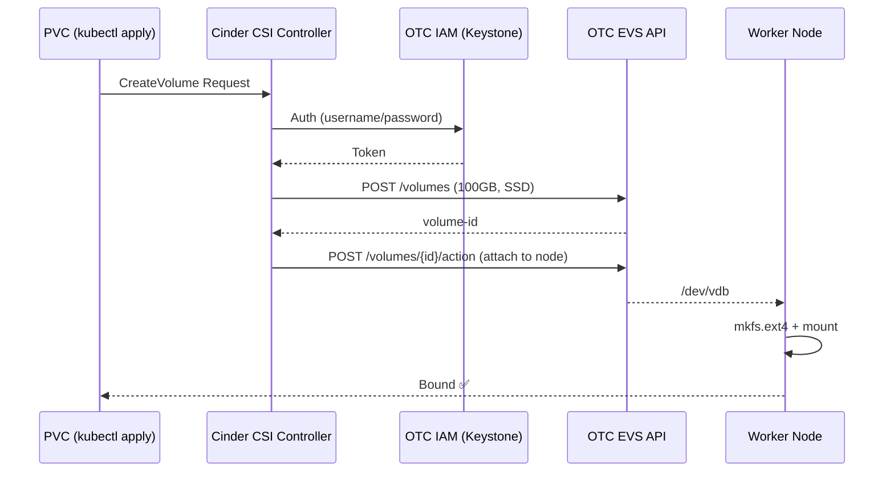
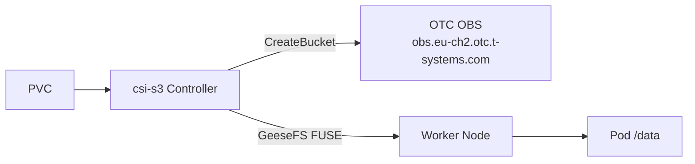

# Storage auf Swiss OTC — EVS & OBS

## Überblick

Der Stack unterstützt zwei Storage-Backends:

| Backend | Typ | CSI Driver | Use Case |
|---------|-----|-----------|----------|
| **EVS** | Block (RWO) | openstack-cinder-csi | Datenbanken, persistente Workloads |
| **OBS** | Object (S3) | csi-s3 (GeeseFS) | Logs, Backups, Shared Assets |

---

## EVS — Elastic Volume Service (Block Storage)

### Wie es funktioniert

OTC EVS ist OpenStack Cinder-kompatibel. Der `openstack-cinder-csi` Driver nutzt die Keystone-API für Auth und die EVS/Cinder API für Volume-Management.



### StorageClasses

```yaml
# Default — Volumes werden beim PVC-Delete gelöscht
csi-cinder-sc-delete   # Reclaim: Delete, Default: true

# Für Produktion — Volumes bleiben nach PVC-Delete erhalten
csi-cinder-sc-retain   # Reclaim: Retain, Default: false
```

### Beispiel: Datenbank mit EVS

```yaml
apiVersion: v1
kind: PersistentVolumeClaim
metadata:
  name: postgres-data
spec:
  accessModes: [ReadWriteOnce]
  storageClassName: csi-cinder-sc-retain   # Retain für Produktion!
  resources:
    requests:
      storage: 100Gi
---
apiVersion: apps/v1
kind: Deployment
metadata:
  name: postgres
spec:
  template:
    spec:
      containers:
      - name: postgres
        image: postgres:16
        env:
        - name: PGDATA
          value: /var/lib/postgresql/data/pgdata
        volumeMounts:
        - mountPath: /var/lib/postgresql/data
          name: data
      volumes:
      - name: data
        persistentVolumeClaim:
          claimName: postgres-data
```

### Wichtige Hinweise

- **RWO only**: EVS Volumes können nur an **einen** Node gleichzeitig gemountet werden
- **AZ-bound**: Volumes sind an eine AZ gebunden — Pod muss im selben AZ schedulen
- **Resize**: `allowVolumeExpansion: true` → `kubectl patch pvc` für Online-Resize
- **Snapshots**: VolumeSnapshotClass vorhanden (Cinder CSI unterstützt Snapshots)

---

## OBS — Object Storage Service (S3-kompatibel)

> **Status**: In Planung — wird als nächstes integriert

### Wie es funktioniert

OTC OBS ist vollständig S3-kompatibel. Der `csi-s3` Driver (GeeseFS-based) mountet OBS Buckets als FUSE-Dateisystem in Pods.



### Endpoint

```
https://obs.eu-ch2.otc.t-systems.com
```

### Geplante StorageClass

```yaml
apiVersion: storage.k8s.io/v1
kind: StorageClass
metadata:
  name: csi-obs
provisioner: ru.yandex.s3.csi
parameters:
  mounter: geesefs
  options: "--memory-limit 1000 --dir-mode 0777 --file-mode 0666"
  bucket: ""          # leer = auto-create pro PVC
  csi.storage.k8s.io/provisioner-secret-name: csi-s3-secret
  csi.storage.k8s.io/provisioner-secret-namespace: kube-system
  csi.storage.k8s.io/controller-publish-secret-name: csi-s3-secret
  csi.storage.k8s.io/controller-publish-secret-namespace: kube-system
  csi.storage.k8s.io/node-stage-secret-name: csi-s3-secret
  csi.storage.k8s.io/node-stage-secret-namespace: kube-system
  csi.storage.k8s.io/node-publish-secret-name: csi-s3-secret
  csi.storage.k8s.io/node-publish-secret-namespace: kube-system
```

### Vergleich EVS vs OBS

| Kriterium | EVS (Cinder CSI) | OBS (csi-s3) |
|-----------|-----------------|--------------|
| Access Mode | ReadWriteOnce | ReadWriteMany |
| Performance | Hoch (Block I/O) | Mittel (FUSE) |
| Use Case | DBs, Stateful Apps | Logs, Backups, Shared Files |
| Preis | Höher | Günstiger |
| Protokoll | Block Device | S3 / FUSE |
| Multi-Node | ❌ | ✅ |
