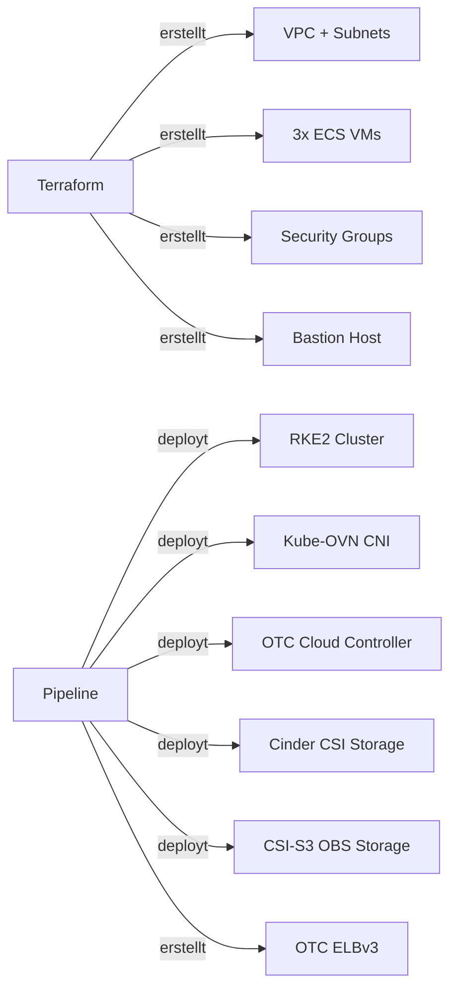

# Team Onboarding — Swiss OTC RKE2 Cloud Manager

Dieses Dokument erklärt, wie ein neues Team-Mitglied den Cluster eigenständig deployen kann.

## Voraussetzungen

### OTC Account
- Swiss OTC Account (Region `eu-ch2`)
- IAM User mit folgenden Berechtigungen:
  - `ECS FullAccess`
  - `VPC FullAccess`
  - `ELB FullAccess`
  - `EVS FullAccess`
  - `OBS OperateAccess`
- AK/SK Keypair generiert (unter Mein Account → Zugangsdaten)

### GitHub
- Zugang zum Repository `Wolfslight-Forgehouse/rke2-sotc-cloud-manager`
- Berechtigung um GitHub Actions manuell zu triggern

## Setup in 4 Schritten

### Schritt 1: Repository forken/klonen

```bash
git clone https://github.com/Wolfslight-Forgehouse/swiss-otc-k8s-cloud-manager-infra.git
cd swiss-otc-k8s-cloud-manager-infra
```

### Schritt 2: GitHub Secrets setzen

Unter **Settings → Secrets and variables → Actions → Environments → production**:

| Secret | Beschreibung | Wo bekomme ich es? |
|--------|--------------|-------------------|
| `OTC_ACCESS_KEY` | OTC AK (Access Key) | OTC Console → Mein Account → Zugangsdaten |
| `OTC_SECRET_KEY` | OTC SK (Secret Key) | Beim AK/SK erstellen — einmalig sichtbar! |
| `OTC_PROJECT_ID` | OTC Projekt-ID | OTC Console → IAM → Projekte |
| `OBS_TFSTATE_BUCKET` | OBS Bucket für Terraform State | Selbst anlegen (Schritt 3) |
| `SSH_PUBLIC_KEY` | SSH Public Key für VM-Zugang | `ssh-keygen -t ed25519` → .pub Datei |
| `SSH_PRIVATE_KEY_B64` | SSH Private Key (Base64) | `base64 -w0 ~/.ssh/rke2-key` |
| `RKE2_TOKEN` | RKE2 Cluster Secret | Zufälliger String: `openssl rand -hex 32` |

### Schritt 3: OBS Bucket für Terraform State erstellen

```bash
# Via OTC Console: OBS → Bucket erstellen
# Name: z.B. "mein-team-rke2-tfstate"
# Region: eu-ch2
# ACL: Private
# Versioning: aktivieren (empfohlen)
```

> Den Bucket-Namen als `OBS_TFSTATE_BUCKET` Secret eintragen.

### Schritt 4: GitHub Repository Variable setzen

Unter **Settings → Secrets and variables → Actions → Variables**:

| Variable | Wert | Beschreibung |
|----------|------|--------------|
| `CNI_PLUGIN` | `kube-ovn` oder `cilium` | CNI auswählen (Kube-OVN empfohlen) |

### Schritt 5: Deploy triggern

Unter **Actions → Terraform Apply → Run workflow**:
- Branch: `main`
- Environment: `production`

⏱️ Dauer: ~25-35 Minuten

## Was wird deployed



## Kosten (Swiss OTC, ungefähr)

| Ressource | Typ | Kosten/h |
|-----------|-----|----------|
| Master Node | s3.xlarge.4 (4 vCPU, 16GB) | ~0.06 CHF |
| Worker Node ×2 | s3.large.4 (2 vCPU, 8GB) | ~0.04 CHF je |
| Bastion | s3.medium.4 (1 vCPU, 4GB) | ~0.02 CHF |
| ELB | ELBv3 Shared | ~0.01 CHF |
| EVS Disk ×3 | 50GB SSD | ~0.005 CHF je |
| EIP ×2 | Bastion + ELB | ~0.01 CHF je |
| **Total** | | **~0.20 CHF/h** |

> 💡 Zum Testen: nach dem Test mit **Terraform Destroy** alles wieder löschen.

## Nach dem Deploy

```bash
# Outputs aus Pipeline-Log kopieren:
BASTION_IP=<aus Pipeline>
ELB_IP=<aus Pipeline>

# kubectl Zugriff via SSH-Tunnel
ssh -i ~/.ssh/rke2-key -L 6443:10.0.1.10:6443 ubuntu@$BASTION_IP -N &
export KUBECONFIG=/tmp/kubeconfig.yaml

# Nodes checken
kubectl get nodes
kubectl get pods -n kube-system | grep -E "ovn|kube-ovn"
```

Vollständige Anleitung: [docs/POST-INSTALL.md](POST-INSTALL.md)

## Troubleshooting

### Kube-OVN startet nicht
→ Vollständige Anleitung: [docs/KUBE-OVN.md](KUBE-OVN.md)

### ELB bekommt keine IP
```bash
kubectl describe svc <service-name>
kubectl logs -n kube-system deployment/swiss-otc-ccm
```

### Terraform schlägt fehl
- OTC Quota prüfen (ECS, EIP, ELB)
- AK/SK Berechtigungen prüfen
- Region `eu-ch2` in allen Secrets korrekt?

## Security Hinweise

- ✅ Keine Credentials im Code — alles via GitHub Secrets
- ✅ Bastion Host als einziger SSH-Einstiegspunkt
- ✅ Worker Nodes nicht direkt erreichbar (private IPs)
- ✅ RKE2 API Server nur intern (`10.0.1.10:6443`)
- ⚠️ SSH Key regelmässig rotieren
- ⚠️ AK/SK auf minimale Berechtigungen beschränken
- ⚠️ Nach Tests: `Terraform Destroy` triggern → Kosten vermeiden

## Support

- Engineering Log: [docs/ENGINEERING-LOG.md](ENGINEERING-LOG.md)
- Confluence: [RKE2 Swiss OTC](https://madcluster.atlassian.net/wiki/spaces/WL/pages/570589186)
- Probleme: GitHub Issues im Repo
