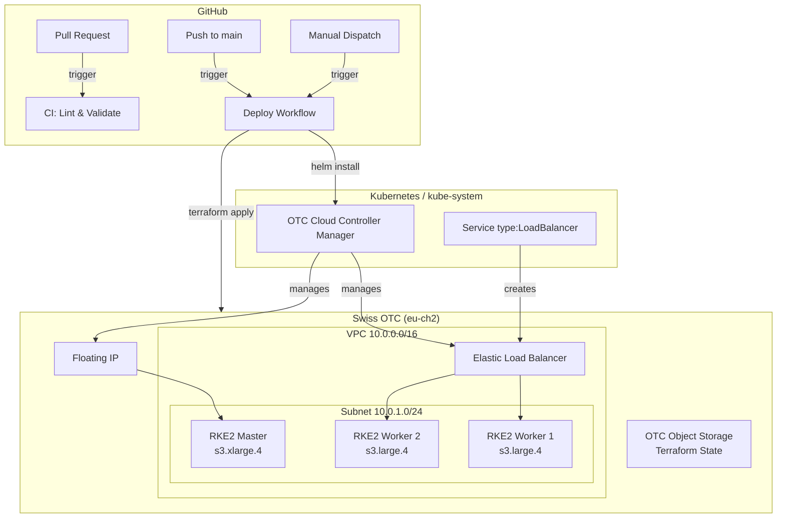
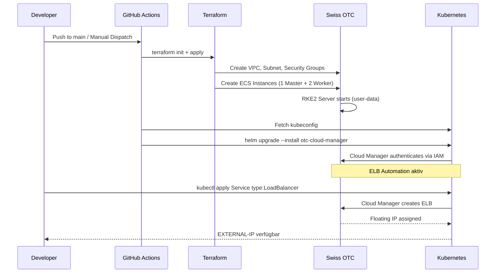
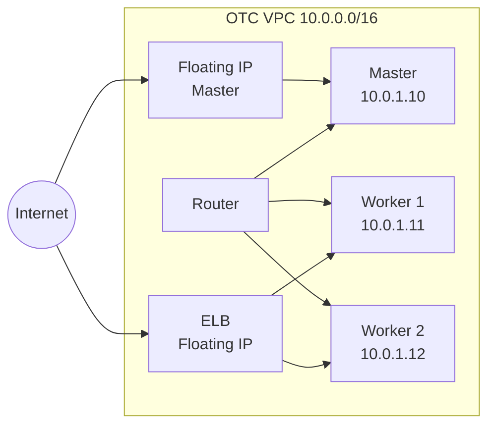

# Architecture — RKE2 auf Swiss OTC mit Cloud Manager

## Überblick

RKE2 Kubernetes Cluster auf der Swiss Open Telekom Cloud (Region eu-ch2) mit automatischem ELB-Management via OTC Cloud Controller Manager.

## Komponenten

## Deployment Flow

## Netzwerk-Topologie

